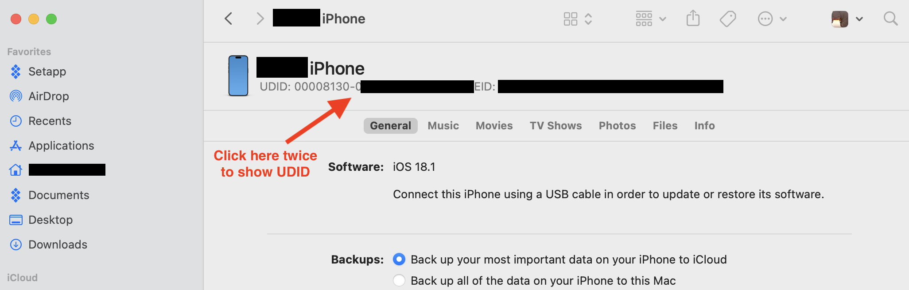
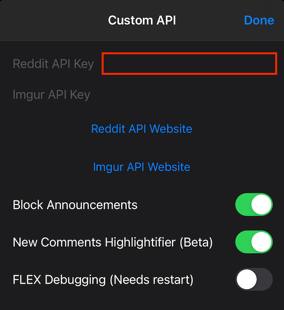

  

&nbsp;

&nbsp;

## Device Preparation

### Place Device into Developer Mode

1. Settings > Privacy & Security > Developer Mode (Bottom) 
2. Set to On
3. Restart
4. "Ready to Enable Developer Mode" Screen
5. Swipe Up to Continue and Enable
6. Enter Passcode
7. Device will restart

### Register UDID

1. Connect device to Mac and allow Data Access
2. Open Finder and Select your device (on the left side)
3. Click under the device's name until UDID shows up

4. Copy UDID and send it to me

## For Sideloading

Browse to the below url on your device's browser and install:

https://ipa.ipasign.cc:2052/download/4762b9df-8ce0-3984-05f9-815dc6c8ed31/20240804232314401

## Reddit Settings

1. Sign into your reddit account (on desktop) and go here:  
    [https://reddit.com/prefs/apps](https://reddit.com/prefs/apps)
2. Click the `are you a developer? create an app...` button
3. Fill in the fields
	* name: Use whatever
	* Choose `Installed App`
	* description: Use whatever
	* about url: Use whatever
	* redirect uri: **`apollo://reddit-oauth`**
4. `create app`

5. After creating the app you'll get a client identifier

6. Enter it in the "Reddit API Key" in the Apollo app settings
   (Apollo > Settings > General > Custom API)

## Imgur Settings
**Apollo currently works without Imgur settings. Only required if you'll upload pics to your account.**

1. Sign into your imgur account (on desktop) and go here:
   [https://api.imgur.com/oauth2/addclient](https://api.imgur.com/oauth2/addclient)

2. Fill in the fields
	* Application name: Use whatever
	* Authorization type: Choose `OAuth 2 authorization without a callback URL`
	* Email: Use your email
	* Description: Use whatever

3. `submit`

4. After creating the app you'll get a client identifier "Client ID".

5. Enter it in the "Imgur API Key" in the Apollo app settings.
   (Apollo > Settings > General > Custom API)

# From 

https://github.com/JeffreyCA/Apollo-ImprovedCustomApi

https://apolloapp.io/
